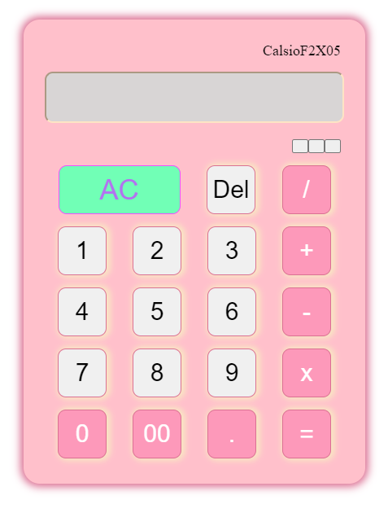

# Calculator
- A calculator is an electronic device that performs arithmetic and mathematical operations. It can be used to perform basic calculations, such as addition, subtraction, multiplication, and division, as well as more complex calculations, such as trigonometry and logarithms. Calculators have a variety of different buttons and symbols, which allow users to enter specific mathematical expressions and perform calculations quickly and accurately.  
## Image
